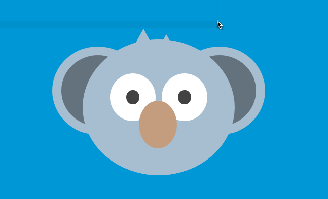

## Images created using pure CSS 
That's right. :smile: Layering a bunch of HTML elements with the right colors and layering techniques results in amazing images.

This code was written as a completion of the course on CSS images.
Original course document on building the koala can be found [here](https://medium.com/coding-artist/a-beginners-guide-to-pure-css-images-ef9a5d069dd2).

Using the knowledge gained from the Koala exercise, I built Santa Claus trying to achieve [this](https://codemyui.com/laughing-santa-claus-in-pure-css/) 
## You want to use this code?
Fine by me. Follow these steps:
1. Clone/download the repository
2. Navigate to the root directory
3. Right click and `open in terminal`
4. Run `live-server`

> This is assuming that you have [live-server](https://www.npmjs.com/package/live-server) installed. If not, you can always do a quick `npm install -g live-server`.  

Alternatively, run the code the old fashioned `file:///pathToIndexFile` way.

## Why?
Well, there are a number of reasons:

1. fun :wink:
2. to gain a deeper understanding of CSS (especially layering) :muscle:
3. to pass time 
4. any other reason you want

## Result?
Koala from the exercise

Santa Claus

